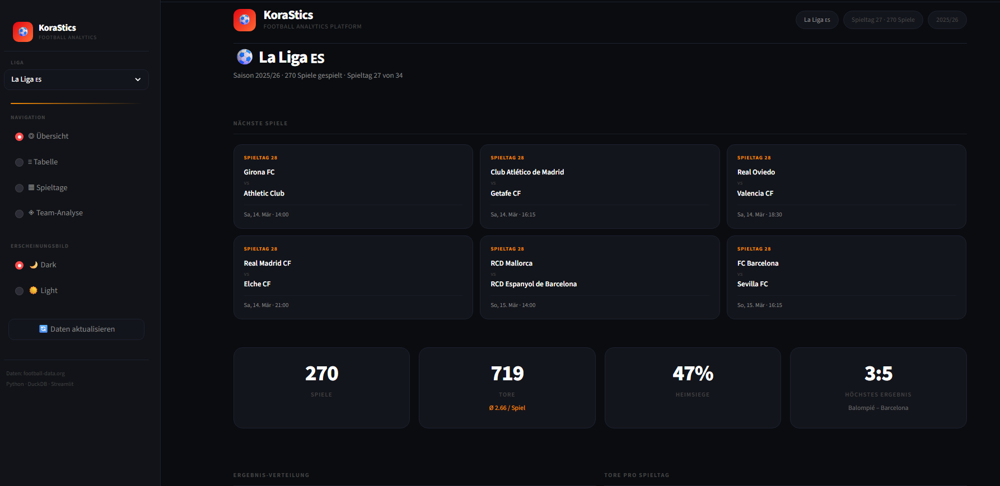
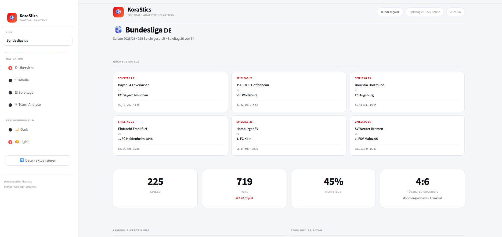
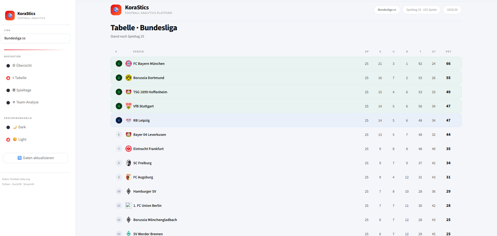
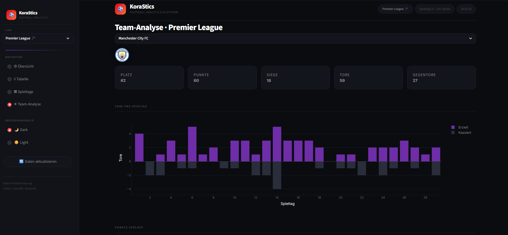

<div align="center">

# ⚽ KoraStics
### Football Analytics Platform

**End-to-end Data Engineering Projekt** — Live API-Daten, ETL-Pipeline, interaktives Dashboard.

[](https://python.org)
[](https://streamlit.io)
[](https://duckdb.org)
[](https://plotly.com)

**[🚀 Live Demo](https://djzh23-sport-data-pipeline.streamlit.app)** · **[📋 API Dokumentation](https://www.football-data.org)**

</div>

---

## Screenshots

| Übersicht · Dark Mode | Übersicht · Light Mode |
|:---:|:---:|
|  |  |

| Liga-Tabelle | Team-Analyse |
|:---:|:---:|
|  |  |

---

## Was das Projekt macht

KoraStics lädt Live-Spielpaarungsdaten von [football-data.org](https://www.football-data.org/), verarbeitet sie durch eine strukturierte ETL-Pipeline, speichert sie in einer lokalen DuckDB-Datenbank und stellt sie als interaktives mehrseitiges Dashboard bereit.

**Unterstützte Ligen:** Bundesliga 🇩🇪 · Premier League 🏴󠁧󠁢󠁥󠁮󠁧󠁿 · La Liga 🇪🇸

---

## Architektur

```
football-data.org API
        │
        ▼
  extract.py   →   transform.py   →   load.py   →   dashboard/app.py
  (requests)        (pandas)          (DuckDB)       (Streamlit + Plotly)
```

Jede Stufe ist klar getrennt und unabhängig austauschbar — dasselbe Prinzip wie in professionellen Data-Engineering-Projekten mit Snowflake oder Databricks.

---

## Tech Stack

| Schicht | Technologie | Zweck |
|---------|-------------|-------|
| Extraktion | Python `requests` | HTTP-Anfragen an die REST API |
| Transformation | `pandas` | Datenbereinigung, Aggregation, Tabellenberechnung |
| Speicherung | `DuckDB` | Lokale SQL-Analyse-Engine — kein Server nötig |
| Dashboard | `Streamlit` + `Plotly` | Interaktives Web-Dashboard mit Hover-Charts |

---

## Features

- **ETL-Pipeline** mit sauberer Trennung von Extract, Transform und Load
- **Nächste Spiele** — kommende Partien auf der Übersichtsseite
- **Liga-Tabelle** mit Champions League / Europa League / Abstiegszone-Hervorhebung
- **Team-Analyse** — Tore pro Spieltag, kumulierter Punkteverlauf, Sieg/Unentschieden/Niederlage-Donut
- **Spieltage-Ansicht** — Ergebniskarten mit Sieger-Hervorhebung
- **Dark / Light Theme** umschaltbar
- **3 Ligen** live aus der Seitenleiste wechselbar
- **Interaktive Plotly-Charts** — Hover-Tooltips, Zoom, Pan
- **Mobile-optimiert** — responsives Layout für alle Bildschirmgrößen

---

## Projektstruktur

```
sport-data-pipeline/
├── dashboard/
│   └── app.py          # Streamlit-Dashboard (KoraStics)
├── pipeline/
│   ├── extract.py      # API-Datenextraktion
│   ├── transform.py    # Datentransformation & Tabellenberechnung
│   ├── load.py         # DuckDB-Persistenz
│   └── check_api.py    # API-Validierungshilfe
├── screenshots/        # Dashboard-Screenshots für Portfolio
├── data/               # Zur Laufzeit generiert (gitignore)
├── main.py             # ETL-Pipeline Einstiegspunkt
├── requirements.txt
└── .env.example
```

---

## Installation & Start

**1. Repository klonen**
```bash
git clone https://github.com/djzh23/sport-data-pipeline.git
cd sport-data-pipeline
```

**2. Virtuelle Umgebung erstellen**
```bash
python -m venv venv
source venv/bin/activate        # Linux/macOS
venv\Scripts\activate           # Windows
```

**3. Abhängigkeiten installieren**
```bash
pip install -r requirements.txt
```

**4. API-Key konfigurieren**

`.env.example` zu `.env` kopieren und API-Key eintragen (kostenlose Registrierung auf [football-data.org](https://www.football-data.org/client/register)):
```bash
cp .env.example .env
# .env öffnen und FOOTBALL_API_KEY=dein_key eintragen
```

**5. ETL-Pipeline ausführen** *(optional — Dashboard lädt Daten direkt live)*
```bash
python main.py
```

**6. Dashboard starten**
```bash
streamlit run dashboard/app.py
```

---

<div align="center">

Entwickelt von [Zouhair Ijaad](https://github.com/djzh23) · 2026

</div>
